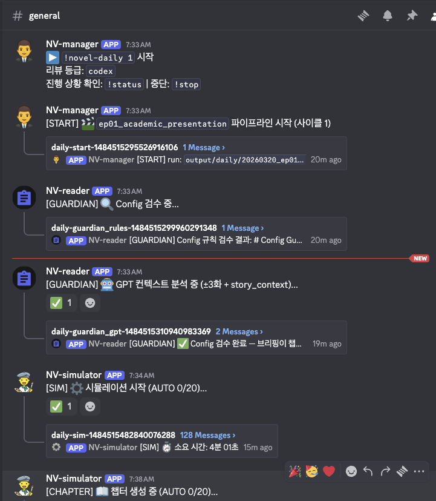
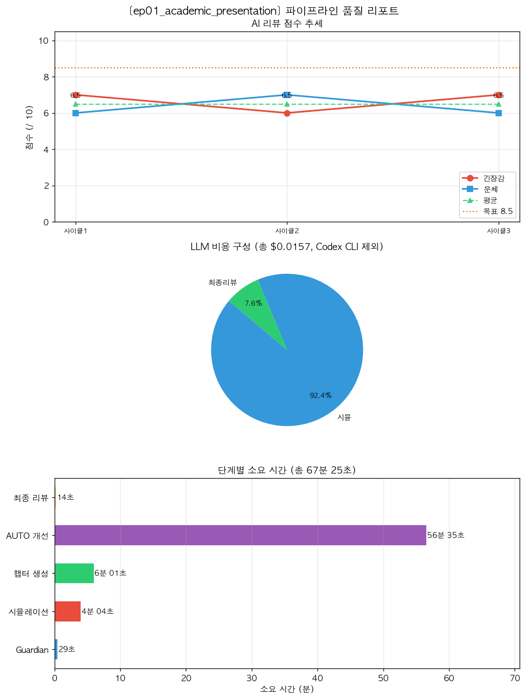

# Novel Writer

이 프로젝트는 "에피소드 설정 파일"을 "읽을 수 있는 소설 챕터"로 바꾸고, 그 결과를 Discord에서 계속 개선해 나가는 시스템입니다.

이 저장소에서 가장 중요한 진입점은 `!novel-daily`입니다.  
처음 쓰는 사람은 다른 스크립트보다 이 명령부터 이해하면 됩니다.



## 먼저 보여드릴게요

이 프로젝트는 이런 식의 에피소드 설정을 입력으로 받습니다.

```yaml
episode:
  id: ep01_conference_shadow
  summary: >
    제네바 컨퍼런스 센터에서 모레노 교수의 초전도 큐비트 발표가 열린다.
    수민은 발표를 들으며 자신의 보상 회로 아이디어가 실제 시스템 수준에서
    통할 수 있다는 가능성을 처음으로 실감한다.
    발표장 곳곳에는 이 연구를 단순한 학문적 성과가 아니라 전략 자산으로
    평가하는 듯한 인물들이 보인다.
```

그리고 실제 실행 후에는 이런 식의 소설 문장으로 변환됩니다.

> 2041년 5월 21일, 수민은 그날의 공기가 바뀌는 순간을 또렷하게 감지했다.
>
> 모레노의 목소리가 높은 슬라이드와 함께 잔향처럼 흘러나왔다. 수민은 통로 쪽에 비스듬히 기대어 서서 화면을 훑었다. 숫자 하나가 아니었다. 발표가 건드린 문제의 결이 그가 지난 몇 해 붙들고 있던 것과 정확히 맞닿아 있었다.
>
> 청중 가운데 어떤 이들의 시선이 달랐다. 박수 대신 계산표를 보는 눈이었다. 표준적 경외가 아니라 적용 가능성을 재는 얼굴들이었다.

즉, 이 프로젝트가 하는 일은 단순한 요약이나 텍스트 확장이 아닙니다.

- 에피소드 설정을 읽고
- 캐릭터들이 실제로 상호작용하도록 시뮬레이션한 뒤
- 장면을 압축하고
- 한국어 소설 문체로 챕터를 만들고
- 리뷰와 피드백을 받아
- 코드 또는 스토리 설정까지 다시 고치는 루프를 돌립니다

처음 README를 읽는 사람이 느껴야 하는 핵심은 이것입니다.

> "아, 이건 설정 파일 하나를 넣으면 소설 초고를 만들고, Discord 안에서 계속 다듬어가는 시스템이구나."

## `!novel-daily`는 왜 흥미로운가

보통은 아래 작업을 사람이 따로따로 해야 합니다.

1. 설정 파일 확인
2. 시뮬레이션 실행
3. 챕터 생성
4. 품질 검사
5. 피드백 정리
6. 코드나 설정 수정
7. 다시 실행

`!novel-daily`는 이 과정을 하나의 루프로 묶습니다.

```text
episode.yaml
  -> 시뮬레이션
  -> 챕터 생성
  -> 자동 리뷰
  -> 리포트 이미지 생성
  -> Discord에서 사용자 피드백 수집
  -> 코드 수정 또는 스토리 수정
  -> 자동 재실행
```

그래서 사용자는 Discord에서 이렇게 느끼게 됩니다.

- "실행이 어떻게 진행되는지 실시간으로 보인다"
- "생성된 챕터를 바로 읽을 수 있다"
- "마음에 안 들면 코드 수정이나 스토리 수정을 바로 요청할 수 있다"
- "수정 후 다시 돌려보는 루프까지 연결된다"

## 실제 Discord 데모 예시

아래는 처음 사용하는 사람이 가장 빠르게 감을 잡을 수 있는 예시입니다.  
실제 메시지는 더 길 수 있지만, 흐름은 대체로 이렇게 흘러갑니다.

```text
User
!novel-daily 1

Bot
리뷰 등급을 골라주세요.
1 또는 mini      — GPT-4o-mini
2 또는 premium   — GPT-4o
3 또는 codex     — Codex CLI

User
2

Bot
▶️ !novel-daily ep01_academic_presentation 시작
리뷰 등급: premium
진행 상황 확인: !status | 중단: !stop

Bot
[GUARDIAN] Config 검수 시작

Bot
[SIM] 시뮬레이션 시작

Bot
[SIM] Turn 7/28

Bot
[CHAPTER] 챕터 생성 중

Bot
[AUTO] AI 자동 개선 루프 1/20 시작

Bot
[REVIEW] 자동 검수 완료
긴장감: 8/10
문체: 8/10
인과성: 7/10

Bot
개선 방향을 선택해주세요.
1 코드 수정
2 스토리 수정
3 다음으로

User
1 초반 대사가 조금 딱딱하고 설명투야. 긴장감을 더 빨리 올려줘.

Bot
[CHOICE] 코드 수정 선택 — Codex Fixer 실행 중...

Bot
[CHAPTER] 수정된 코드로 챕터 재생성 중...

Bot
[DONE] 코드 수정 완료. 같은 화 재시도: !novel-daily ep01_academic_presentation
```

이 예시에서 중요한 포인트는 세 가지입니다.

- 사용자는 Discord에서 명령만 입력하면 됩니다.
- 봇은 실행, 리뷰, 개선, 재실행까지 한 흐름으로 이어갑니다.
- 마지막에는 "다음 화로 갈지", "코드를 고칠지", "스토리를 고칠지"를 다시 선택할 수 있습니다.

중간에 현재 상태가 궁금하면 이렇게 확인할 수 있습니다.

```text
User
!status

Bot
현재 파이프라인 상태: 챕터 생성 중
경과 시간: 6분 12초
세션 누적 토큰: ...
세션 누적 비용: ...
```

## 먼저 이해하면 좋은 한 줄 요약

`!novel-daily`는 아래 일을 한 번에 처리합니다.

1. 에피소드 설정 검사
2. 캐릭터 시뮬레이션 실행
3. 챕터 생성
4. 품질 리뷰와 자동 개선
5. 사용자 피드백 반영
6. 다음 실행을 위한 상태 저장

즉, "에피소드 하나를 돌려서 읽고, 고치고, 다음 화로 넘길지 결정하는 전체 작업 흐름"이 Discord 안에서 돌아갑니다.

## 처음 설치하는 사람용 빠른 안내

정말 처음이라면 이 순서만 따라오면 됩니다.

1. Python 환경을 준비합니다.
2. OpenAI API 키를 발급받습니다.
3. Discord Developer Portal에서 봇을 만듭니다.
4. 봇을 서버에 초대하고 권한을 줍니다.
5. `.env` 파일에 키와 토큰을 넣습니다.
6. `python tools/discord_loop_bot.py`로 봇을 실행합니다.
7. Discord 채널에서 `!novel-daily 1`을 입력합니다.

아래부터는 이 과정을 아주 자세히 설명합니다.

## `!novel-daily`가 실제로 하는 일

`!novel-daily ep01_academic_presentation`을 실행하면 대략 아래 순서로 움직입니다.

```text
episode config
  -> Config Guardian
  -> Simulator
  -> Chapter Generator
  -> Auto Review / Auto Improve Loop
  -> Final Review
  -> 사용자 선택:
       1 코드 수정
       2 스토리 수정
       3 다음으로 진행
  -> story_state.json 업데이트
```

실행 중에는 Discord에서 진행 메시지가 계속 올라오고, 끝나면 챕터 파일과 리포트 이미지도 받을 수 있습니다.

## 준비물

이 프로젝트를 처음 실행하려면 아래가 필요합니다.

- Python 3.10 이상
- OpenAI API 키
- Discord 서버 하나
- Discord 봇 토큰 1개 이상

중요:

- `OPENAI_API_KEY`는 반드시 필요합니다.
- `--review-tier codex`를 써도 OpenAI API 키는 여전히 필요합니다.
  이유: 리뷰 일부를 Codex CLI로 돌릴 수는 있어도, 시뮬레이션과 챕터 생성 자체는 OpenAI API를 사용하기 때문입니다.

## 1. Python 설치와 프로젝트 준비

### 1-1. 저장소로 이동

```bash
cd "/Users/saesunkim/Documents/Novel Writter - 2026"
```

### 1-2. 가상환경 생성

권장 방식입니다.

```bash
python3 -m venv .venv
source .venv/bin/activate
```

Windows라면:

```bash
.venv\Scripts\activate
```

### 1-3. 패키지 설치

```bash
pip install -r requirements.txt
```

설치가 끝나면 최소한 `discord.py`, `aiohttp`, `PyYAML`, 그리고 프로젝트 실행에 필요한 라이브러리가 준비됩니다.

## 2. OpenAI API 키 준비

이 프로젝트는 내부적으로 OpenAI API를 사용합니다.  
그래서 ChatGPT 웹 로그인만으로는 부족하고, **API 키**가 필요합니다.

### 2-1. API 키를 왜 넣어야 하나

이 저장소에서 OpenAI API는 주로 아래 작업에 쓰입니다.

- 시뮬레이션 중 캐릭터 행동 생성
- 챕터 본문 생성
- 품질 리뷰 일부
- 피드백 분석

### 2-2. 어디에 넣나

루트에 `.env` 파일을 만들고 아래처럼 넣습니다.

```bash
cp .env.example .env
```

그다음 `.env`를 열어 수정합니다.

```env
OPENAI_API_KEY="sk-..."
DISCORD_BOT_TOKEN="your-main-bot-token"
DISCORD_BOT_TOKEN2=""
DISCORD_BOT_TOKEN3=""
DISCORD_BOT_TOKEN4=""
```

설명:

- `OPENAI_API_KEY`: 필수
- `DISCORD_BOT_TOKEN`: 필수
- `DISCORD_BOT_TOKEN2/3/4`: 선택

## 3. Discord 봇 설정 아주 자세히

이 단계가 가장 중요합니다.  
여기서 한 가지라도 빠지면 봇이 "켜지긴 켜졌는데 명령을 못 읽는" 상태가 되기 쉽습니다.

공식 참고 링크:

- Developer Portal: https://discord.com/developers/applications
- Discord Bot Guide: https://docs.discord.com/developers/guides/bots

### 3-1. Discord Application 만들기

1. 브라우저에서 `https://discord.com/developers/applications`를 엽니다.
2. Discord 계정으로 로그인합니다.
3. `New Application`을 누릅니다.
4. 예를 들어 `Novel Writer Daily` 같은 이름을 넣고 생성합니다.

여기서 만든 "Application"이 봇의 껍데기입니다.

### 3-2. Bot 사용자 만들기

1. 왼쪽 메뉴에서 `Bot`을 엽니다.
2. `Add Bot` 버튼이 보이면 눌러서 봇 사용자를 생성합니다.
3. 생성 후 이 Application 안에 실제 봇 계정이 생깁니다.

### 3-3. 토큰 발급받기

1. 같은 `Bot` 화면에서 토큰 관련 영역을 찾습니다.
2. `Reset Token` 또는 토큰 표시 기능을 이용해 토큰을 확인합니다.
3. 이 값을 `.env`의 `DISCORD_BOT_TOKEN`에 넣습니다.

중요:

- 토큰은 비밀번호처럼 취급해야 합니다.
- Git에 올리면 안 됩니다.
- 유출되면 Developer Portal에서 새 토큰으로 다시 발급해야 합니다.

### 3-4. Message Content Intent 켜기

이 프로젝트는 슬래시 커맨드가 아니라 **일반 메시지 명령**을 읽습니다.

예를 들면:

- `!novel-daily 1`
- `!status`
- `!stop`

코드에서 실제로 `message.content`를 읽기 때문에, **Message Content Intent**가 꺼져 있으면 봇이 명령을 못 읽습니다.

설정 방법:

1. `Bot` 메뉴로 갑니다.
2. `Privileged Gateway Intents` 섹션을 찾습니다.
3. `MESSAGE CONTENT INTENT`를 켭니다.
4. 저장합니다.

이걸 빼먹으면 흔히 발생하는 증상:

- 터미널에는 `Discord bot connected as ...`가 뜸
- 그런데 Discord에서 `!novel-daily`를 입력해도 아무 반응이 없음

### 3-5. 봇을 서버에 초대하기

1. 왼쪽 메뉴에서 `OAuth2` -> `URL Generator`로 갑니다.
2. Scopes에서 `bot`을 선택합니다.
3. Bot Permissions에서 아래 권한을 체크하는 것을 권장합니다.

권장 권한:

- View Channels
- Send Messages
- Read Message History
- Add Reactions
- Attach Files
- Create Public Threads
- Send Messages in Threads

왜 필요한가:

- 메시지를 읽고 답장해야 하므로 `View Channels`, `Send Messages`
- 이전 메시지와 진행 상태를 다루므로 `Read Message History`
- 완료 반응 체크를 달 수 있도록 `Add Reactions`
- 챕터 파일과 리포트 이미지를 업로드하려면 `Attach Files`
- 단계별 앵커 메시지에서 쓰레드를 만들고 그 안에 로그를 보내려면 `Create Public Threads`, `Send Messages in Threads`

3. 아래에 생성된 초대 URL을 복사합니다.
4. 브라우저에 붙여넣고, 원하는 서버에 봇을 초대합니다.

팁:

- 권한이 너무 적으면 봇은 접속해도 파일 업로드나 쓰레드 생성을 못할 수 있습니다.
- 서버 관리 권한이 없는 계정이면 초대 자체가 안 될 수 있습니다.

### 3-6. 선택 사항: 단계별 봇을 따로 쓰고 싶다면

이 저장소는 토큰을 최대 4개까지 받을 수 있습니다.

- `DISCORD_BOT_TOKEN`: 메인 봇
- `DISCORD_BOT_TOKEN2`: reviewer 단계용
- `DISCORD_BOT_TOKEN3`: fixer 단계용
- `DISCORD_BOT_TOKEN4`: manager 단계용

이건 필수가 아닙니다.

초보자에게는 먼저 이렇게 권장합니다.

- 처음에는 `DISCORD_BOT_TOKEN` 하나만 사용
- `DISCORD_BOT_TOKEN2/3/4`는 비워두기

이 경우 코드가 자동으로 메인 봇 토큰을 재사용합니다.

반대로 "단계별로 서로 다른 봇 프로필 사진과 이름으로 말하게 만들고 싶다"면:

1. Discord Application을 추가로 더 만듭니다.
2. 각각 Bot을 생성합니다.
3. 각 토큰을 `.env`의 `DISCORD_BOT_TOKEN2/3/4`에 넣습니다.
4. **모든 봇을 같은 서버에 초대하고, 같은 채널 권한을 주어야 합니다.**

즉, 토큰만 넣고 초대를 안 하면 작동하지 않습니다.

### 3-7. 채널 운영 방식도 중요합니다

이 봇은 **채널 단위로 상태를 기억**합니다.

쉽게 말하면:

- 채널 A에서 돌리는 파이프라인 1개
- 채널 B에서 돌리는 파이프라인 1개

처럼 생각하는 게 안전합니다.

권장 운영 방식:

- 에피소드 실험용 채널을 따로 하나 만듭니다.
- 동시에 여러 개 돌리고 싶으면 채널을 나눕니다.

같은 채널에서 서로 다른 사람이 동시에 다른 에피소드를 막 섞어 돌리면 혼란스러워질 수 있습니다.

## 4. `.env` 파일 설정 예시

초심자용 권장 예시는 아래입니다.

```env
OPENAI_API_KEY="sk-your-real-openai-api-key"
DISCORD_BOT_TOKEN="your-main-bot-token"

# 처음에는 비워둬도 됩니다.
DISCORD_BOT_TOKEN2=""
DISCORD_BOT_TOKEN3=""
DISCORD_BOT_TOKEN4=""

# 예전 이름도 호환되지만 새 이름을 권장합니다.
TOKEN2=""
TOKEN3=""
TOKEN4=""
```

### 어떤 값이 꼭 필요한가

필수:

- `OPENAI_API_KEY`
- `DISCORD_BOT_TOKEN`

선택:

- `DISCORD_BOT_TOKEN2`
- `DISCORD_BOT_TOKEN3`
- `DISCORD_BOT_TOKEN4`

## 5. 봇 실행하기

루트 디렉터리에서 실행합니다.

```bash
python tools/discord_loop_bot.py
```

정상 실행되면 터미널에 비슷한 로그가 뜹니다.

```text
Discord bot connected as <봇이름>
```

이 문장이 안 뜨면:

- 토큰이 잘못됐거나
- 네트워크 문제이거나
- 패키지 설치가 안 되었을 가능성이 큽니다.

## 6. 첫 실행: 정말 처음이라면 이렇게 하세요

### 6-1. 가장 쉬운 첫 명령

Discord 채널에서 아래처럼 입력합니다.

```text
!novel-daily 1
```

또는 에피소드 키를 알고 있으면:

```text
!novel-daily ep01_academic_presentation
```

숫자를 넣으면 내부에서 해당 번호에 맞는 에피소드 파일을 찾아 실행합니다.

### 6-2. 옵션을 같이 주는 방식

```text
!novel-daily ep01_academic_presentation --target-words 3500 --budget 4.0 --protagonist kim_sumin --review-tier premium
```

자주 쓰는 옵션:

- `--target-words 3500`: 목표 분량
- `--budget 4.0`: 실행 예산
- `--protagonist kim_sumin`: 주인공 ID
- `--review-tier mini|premium|codex`: 리뷰 방식

### 6-3. `--review-tier`를 안 넣으면 어떻게 되나

봇이 먼저 물어봅니다.

```text
1 또는 mini      -> 빠르고 저렴
2 또는 premium   -> 더 정밀
3 또는 codex     -> Codex CLI 활용
```

초보자에게는 보통 아래처럼 시작하는 걸 권장합니다.

- 빠르게 테스트: `mini`
- 좀 더 정밀하게: `premium`

주의:

- `codex`를 선택해도 프로젝트 전체에서 OpenAI API 키가 없어도 되는 것은 아닙니다.
- 리뷰 일부 비용만 줄어드는 방식으로 이해하는 게 맞습니다.

## 7. 실행 중에 Discord에서 보게 되는 것

`!novel-daily`를 실행하면 채널에 아래 순서로 메시지가 올라옵니다.
각 단계는 **앵커 메시지**와 **쓰레드**로 나뉘어 표시됩니다. 단계가 완료되면 앵커 메시지에 ✅ 반응이 붙고, 쓰레드 안에도 ✅ 텍스트가 들어옵니다.

### 0단계 — 시작 확인

Manager 봇이 리뷰 등급을 물어봅니다.
사용자가 등급을 고르면 `[START] 🎬` 앵커 메시지와 쓰레드가 생성되고, 파이프라인이 백그라운드에서 시작됩니다.
이후 `[GUARDIAN]` 단계가 시작되는 순간 `[START]` 쓰레드에 ✅가 들어옵니다.

```text
Manager봇: 리뷰 등급을 골라주세요. (mini / premium / codex)
User:       1
Manager봇: ▶️ !novel-daily ep01 시작 [START] 🎬  ← 앵커 + 쓰레드 생성
             └─ 쓰레드 안: [START] run: ...
```

### 1단계 — Config Guardian

Reader 봇이 YAML 설정 검사를 맡습니다.
규칙 검사와 GPT 컨텍스트 분석이 각각 별도 앵커와 쓰레드로 표시됩니다.

```text
Reader봇: [GUARDIAN] 🔍 Config 검수 중  ← 앵커 + 쓰레드 생성
           └─ 쓰레드 안: Config 규칙 검수 결과 ...
Reader봇: [GUARDIAN] 🤖 GPT 컨텍스트 분석 중  ← 앵커 + 쓰레드 생성
           └─ 쓰레드 안: GPT 분석 리포트 ...
           └─ 쓰레드 안: ✅ (완료)
```

### 2단계 — Simulator

Simulator 봇이 에피소드 시뮬레이션을 담당합니다.
Director AI가 캐릭터들의 행동을 30~60턴 생성합니다.

```text
Simulator봇: [SIM] ⚙️ 시뮬레이션 시작  ← 앵커 + 쓰레드 생성
              └─ 쓰레드 안: [SIM] ⚙️ 에피소드 ep01_conference_shadow (28턴 / 단서 6개)
              └─ 쓰레드 안: [SIM] ⚙️ Turn 7/28
              └─ 쓰레드 안: [SIM] ⚙️ Turn 14/28
              └─ 쓰레드 안: ✅ 시뮬레이션 완료
```

내부 Python 로그(타임스탬프, 모듈명, 파일경로)는 필터링되어 Discord에 표시되지 않습니다. 에피소드 로드 정보와 진행 턴, 오류만 요약해서 보여줍니다.

### 3단계 — 챕터 생성

Simulator 봇이 챕터 생성도 이어서 맡습니다.
내부적으로는 Scene Distiller(30~60턴 → 6~12장면 압축)와 Prose Generator(문학적 산문 변환)가 순서대로 실행됩니다.

```text
Simulator봇: [CHAPTER] 📖 챕터 생성 중  ← 앵커 + 쓰레드 생성
              └─ 쓰레드 안: [CHAPTER] 🧩 Stage 1 | 목표: 3,500단어 / 7장면 (장면당 ~500단어)
              └─ 쓰레드 안: [CHAPTER] 📝 Scene 1/7
              └─ 쓰레드 안: [CHAPTER] 📝 Scene 4/7
              └─ 쓰레드 안: ✅ 챕터 완성
```

씬 수는 목표 단어수에 따라 동적으로 결정됩니다 (장면당 최대 1,000단어 기준). 예를 들어 3,500단어 → 최소 4장면, 6,000단어 → 최소 6장면을 보장하여 LLM 호출 한 번에 너무 긴 글을 쓰는 상황을 방지합니다.

### 4단계 — AUTO 루프 (자동 개선, 최대 20사이클)

Programmer 봇이 자동 개선 루프 전체를 맡고, Reader 봇이 각 사이클의 AI 리뷰 결과를 채널에 직접 보냅니다.

```text
Programmer봇: [AUTO] 🚀 AI 자동 개선 루프 시작  ← 앵커 + 쓰레드 생성
               └─ 쓰레드 안: [AUTO] 🔄 루프 1/20 시작

Reader봇: [AUTO] 📊 AI 리뷰 결과 (사이클 1)      ← 채널에 직접 (Reader 봇)
           긴장감: 7/10 | 문체: 8/10 | 인과성: 7/10 ...

Manager봇:    [MANAGER] 🧠 매니저 분석  ← 앵커 + 쓰레드 생성
               └─ 쓰레드 안: 매니저 지시사항 ...
               └─ 쓰레드 안: ✅

Programmer봇: [FIXER] 🔧 Codex 수정 시작  ← 앵커 + 쓰레드 생성
               └─ 쓰레드 안: [FIXER] ⚙️
                              수정 중: `prose_generator.py`
                              이번 수정은 기존 훅을 더 정밀하게...
               └─ 쓰레드 안: ✅ Codex 수정 완료

               (챕터 재생성 → 점수 비교 → 다음 사이클 or 완료)
               └─ 쓰레드 안: ✅ (AUTO 루프 완료)
```

평균 점수가 8.5 이상이면 루프가 일찍 종료됩니다.
최대 20사이클을 돌아도 기준을 못 넘으면 그 시점의 결과로 넘어갑니다.

**중요: Codex Fixer가 수정한 내용은 실제 소스 파일에 영구 반영됩니다.**
`prose_generator.py`, `scene_distiller.py`, `director.py` 등을 직접 수정하므로, `!stop` 후 재시작해도 수정된 코드는 그대로 유지됩니다. `git status`로 변경 내역을 확인할 수 있고, 마음에 드는 결과가 나오면 직접 `git commit`으로 기록해 두면 좋습니다.

### 5단계 — 최종 리뷰 & 사용자 선택

Reader 봇이 최종 스코어카드를 보내고, Manager 봇이 선택지를 제시합니다.

```text
Reader봇:  [REVIEW] 🔍 품질 자동 검수 중  ← 앵커 + 쓰레드 생성
            └─ 쓰레드 안: 검수 결과 및 스코어카드 ...
            └─ 쓰레드 안: ✅ 자동 검수 완료

Manager봇: [WAIT] ⏳ 피드백을 기다리고 있습니다.  ← 채널에 직접

User:       1 초반 대사가 딱딱해. 긴장감을 더 빨리 올려줘.

Manager봇: [CHOICE] 📋 개선 방향을 선택해주세요.  ← 앵커 + 쓰레드 생성
            └─ 쓰레드 안: [CHOICE] 1️⃣ 코드 수정 선택 ...
            └─ 쓰레드 안: [CHOICE] ✅ 코드 수정 완료 ...

Manager봇: [DONE] ✅ 완료.  ← 채널에 직접, choice 쓰레드 ✅
```

코드 수정이나 스토리 수정을 선택하면 `discord_loop_bot`이 자동으로 파이프라인을 재시작합니다 (최대 5회).

---

### 단계별 봇 역할 요약

| 봇 | 토큰 | 담당 메시지 |
|---|---|---|
| Simulator | TOKEN1 | `[SIM]`, `[CHAPTER]` |
| Reader | TOKEN2 | `[GUARDIAN]`, `[REVIEW]`, `[AUTO] 📊 리뷰 결과` |
| Programmer | TOKEN3 | `[AUTO]` 루프, `[FIXER]` |
| Manager | TOKEN4 | `[START]`, `[MANAGER]`, `[CHOICE]`, `[WAIT]`, `[DONE]` |

TOKEN2/3/4를 별도로 설정하지 않으면 모두 메인 봇(TOKEN1)이 대신 보냅니다.

---

실행 중에는 언제든 아래 정보를 확인할 수 있습니다.

- 경과 시간
- 누적 토큰
- 누적 비용
- 현재 실행 중인 프로세스

## 8. 결과를 보고 나서 어떻게 답하면 되는가

최종 리뷰가 끝나면 봇이 선택지를 줍니다.

### 8-1. `1` 또는 코드 수정

예:

```text
1 대사가 너무 딱딱해. 문장이 자주 끊겨.
```

이 경우:

- Codex가 코드 쪽을 수정합니다.
- 챕터를 다시 생성합니다.
- 필요하면 자동 재시작도 이어집니다.

### 8-2. `2` 또는 스토리 수정

예:

```text
2 수민이 너무 수동적이야. 초반부터 더 적극적으로 움직였으면 좋겠어.
```

이 경우:

- 에피소드 YAML을 직접 수정합니다.
- 수정 후 **자동으로 YAML 문법 검수**가 실행됩니다.

```text
Programmer봇: [FIXER] 🔍 YAML 검수 시작 — 에피소드 파일 전수 검사 중...  ← 앵커 + 쓰레드 생성
               └─ 쓰레드 안: ✅ YAML 검수 완료 — 총 41개 이상 없음
```

일반적인 YAML 문법 오류(미완성 따옴표 등)는 자동으로 수정됩니다. 수정이 어려운 오류는 파일명과 내용을 알려줍니다.
이 검수 덕분에 에피소드 파일이 깨진 채로 다음 실행에 들어가는 상황을 예방할 수 있습니다.

### 8-3. `3` 또는 다음으로

예:

```text
3
```

이 경우:

- 현재 결과를 승인합니다.
- 다음 에피소드로 넘어갈 준비를 합니다.

### 8-4. 자동 재시작도 있다

코드 수정이나 스토리 수정을 선택한 경우, 봇은 수정된 상태로 파이프라인을 다시 실행할 수 있습니다.

즉:

- 피드백 주기
- 수정
- 재실행
- 다시 확인

의 흐름이 Discord 안에서 이어집니다.

## 9. 꼭 알아둘 명령어

### `!novel-daily`

메인 명령입니다.

예:

```text
!novel-daily 1
!novel-daily ep01_academic_presentation
!novel-daily ep01_academic_presentation --target-words 3200 --budget 4.0 --review-tier premium
```

### `!status`

현재 파이프라인 상태를 봅니다.

확인 가능한 정보:

- 현재 단계
- 경과 시간
- 누적 토큰
- 누적 비용
- 백그라운드 프로세스 상태

### `!stop`

현재 파이프라인 중단 요청을 보냅니다.

즉시 모든 게 사라지는 방식이라기보다, 현재 단계가 정리되는 시점에 맞춰 멈추는 흐름으로 이해하면 됩니다.

### `!chapter`

이 채널에서 가장 최근 생성된 챕터 파일을 다시 받아옵니다.

### `!meitner <질문>`

저장소 구조를 질문하는 도우미 명령입니다.

예:

```text
!meitner daily pipeline이 어디서 시작돼?
```

### `!approve <req_id>` / `!reject <req_id>`

이건 고급 기능입니다.

`data/pending_config_changes.json`에 쌓인 설정 변경 요청을 승인하거나 거절할 때 씁니다.  
처음 쓰는 단계에서는 몰라도 됩니다.

## 10. 실행 후 어떤 파일이 생기나

`!novel-daily`를 돌리면 보통 아래 경로에 실행 결과가 쌓입니다.

```text
output/daily/YYYYMMDD_<episode_key>/HHMMSS/
```

예를 들면:

```text
output/daily/20260320_ep01_academic_presentation/013820/
```

이 안에는 이런 파일들이 생길 수 있습니다.

- `config_check.md`
- `*_simulation.json`
- `*_debug.log`
- `*_chapter.txt`
- `scorecard.txt`
- `auto_review_cycle*.json`
- `pipeline_report.png`

그리고 프로젝트 전체 상태 파일도 갱신됩니다.

- `data/story_state.json`: 사용자 피드백, 점수, 요약, 사이클 상태
- `data/pending_config_changes.json`: 승인 대기 중인 설정 변경 요청

## 11. 리포트 이미지가 왜 있는가

이 프로젝트는 텍스트만 던져주지 않고, 실행 결과를 요약한 이미지도 만들 수 있습니다.

예를 들어 `pipeline_report.png`에는 다음이 들어갈 수 있습니다.

- 사이클별 품질 점수 추이
- 단계별 비용
- 단계별 소요 시간

그래서 README에도 실제 예시 이미지를 넣었습니다.  
초심자가 "아, 이 봇이 단순 채팅이 아니라 실행 결과를 시각적으로도 보여주는구나"를 바로 이해할 수 있게 하려는 목적입니다.



## 12. Discord 없이 직접 실행하고 싶다면

Discord를 붙이기 전에 로컬에서만 테스트할 수도 있습니다.

### 단일 시뮬레이션

```bash
python simulate.py \
  --episode config/episodes/ep05_unexpected_visitors.yaml \
  --characters config/characters.yaml \
  --world config/world_facts.yaml \
  --storyline config/storyline.yaml \
  --budget 5.0
```

### 챕터 생성

```bash
python generate_chapter.py \
  --episode ep05_unexpected_visitors \
  --episode-config config/episodes/ep05_unexpected_visitors.yaml \
  --protagonist kim_sumin \
  --protagonist-name "Kim Sumin" \
  --words 2000
```

### Daily pipeline을 Discord 없이 실행

```bash
python tools/daily_pipeline.py --episode ep01_academic_presentation --no-discord
```

이 방식은 Discord 봇 설정 전에 내부 로직이 도는지 점검할 때 유용합니다.

## 13. 저장소 구조 간단 지도

```text
simulate.py                 # 단일 에피소드 시뮬레이션
generate_chapter.py         # 챕터 생성
trial_simulate.py           # 반복 실험용 실행기

config/                     # 세계관, 캐릭터, 에피소드 설정
src/novel_writer/           # 코어 로직
tools/daily_pipeline.py     # !novel-daily 핵심 파이프라인
tools/discord_loop_bot.py   # Discord 봇 엔트리포인트
tests/                      # 테스트
output/                     # 실행 산출물
data/                       # 상태 파일
```

처음 보는 사람은 아래 세 파일만 먼저 보면 흐름을 파악하기 쉽습니다.

- `tools/discord_loop_bot.py`
- `tools/daily_pipeline.py`
- `simulate.py`

## 14. 자주 막히는 문제와 해결법

### 봇은 켜졌는데 `!novel-daily`에 반응이 없다

가장 흔한 원인:

- `MESSAGE CONTENT INTENT`를 켜지 않음
- 봇이 채널 메시지를 볼 권한이 없음
- 잘못된 채널에서 테스트 중

### `Set DISCORD_BOT_TOKEN in .env` 오류가 난다

원인:

- `.env` 파일이 없거나
- `DISCORD_BOT_TOKEN` 값이 비어 있음

해결:

```bash
cp .env.example .env
```

후에 토큰을 정확히 넣습니다.

### `Set OPENAI_API_KEY in .env` 오류가 난다

원인:

- API 키가 없거나
- `OPENAI_API_KEY`가 비어 있음

해결:

- OpenAI API 키를 발급받아 `.env`에 넣습니다.

### 봇이 메시지는 보내는데 파일 업로드가 안 된다

가능성:

- `Attach Files` 권한이 없음

### 쓰레드 생성이 안 된다

가능성:

- `Create Public Threads`
- `Send Messages in Threads`

권한 중 하나 이상이 없음

### 같은 채널에서 뭔가 꼬이는 것 같다

이유:

- 이 봇은 채널 단위로 상태를 관리합니다.

권장:

- 실험을 분리하려면 채널도 분리하세요.

## 15. 마지막으로: 처음에는 이렇게 시작하는 걸 권장

정말 처음이라면 아래 순서가 가장 무난합니다.

1. `.env`에 `OPENAI_API_KEY`와 `DISCORD_BOT_TOKEN`만 먼저 넣기
2. 봇 한 개만 만들어서 서버에 초대하기
3. `MESSAGE CONTENT INTENT` 켜기
4. `python tools/discord_loop_bot.py` 실행하기
5. Discord에서 `!novel-daily 1` 입력하기
6. 잘 돌면 그다음에 `--review-tier premium`, 다중 봇 토큰, 세부 운영 방식으로 확장하기

처음부터 reviewer/fixer/manager 봇을 모두 분리하려고 하면 설정 포인트가 많아집니다.
처음에는 단일 봇으로 성공 경험을 만든 다음 확장하는 편이 훨씬 쉽습니다.

---

## 최근 변경사항

### 2026-03-20

**Discord 로그 클린 출력**
시뮬레이터와 챕터 생성기의 Python 로그가 Discord에 그대로 출력되던 문제를 수정했습니다.
이제 타임스탬프, 모듈명, 파일 전체 경로 대신 한국어 요약 메시지만 표시됩니다.

```
이전: 10:07:40 [INFO] generate_chapter: Scene data → /Users/.../ep01_scenes.json
이후: [CHAPTER] 🧩 Stage 1 | 씬 분석 완료
```

Fixer 봇도 shell 명령어와 grep 결과 대신 수정 파일명과 한국어 설명만 표시합니다.

---

**동적 씬 수 자동 계산**
챕터 생성 시 씬 수의 최솟값이 하드코딩(4개)에서 목표 단어수 기반 동적 계산으로 바뀌었습니다.
`최소 씬 수 = ceil(목표단어수 / 1000)` 공식을 사용합니다.

| 목표 단어수 | 최소 씬 수 | 씬당 최대 단어 |
|---|---|---|
| 3,500단어 | 4장면 | ~875단어 |
| 6,000단어 | 6장면 | ~1,000단어 |
| 8,000단어 | 8장면 | ~1,000단어 |

씬 하나에 1,500단어 이상이 몰리면 LLM 응답이 10분 이상 걸리거나 타임아웃이 발생할 수 있었는데, 이 기준으로 예방합니다.

---

**스토리 수정 후 YAML 자동 검수**
사용자가 스토리 수정(선택 2)을 요청하면, 수정 완료 직후 `config/episodes/` 전체를 자동으로 검수합니다.
일반 YAML 문법 오류는 Fixer 봇이 감지하고 미완성 따옴표 등 단순한 오류는 자동 수정합니다.
41개 에피소드 파일 전수 검사 → 깨진 파일이 다음 실행에서 에피소드 수 누락(38개 등)으로 나타나는 문제를 예방합니다.

---

**멀티봇 라우팅 고도화**
각 단계가 올바른 봇 토큰을 사용하도록 수정되었습니다.

| 메시지 종류 | 이전 | 이후 |
|---|---|---|
| `[FIXER]` 수정 과정 | Simulator + Programmer 혼용 | Programmer(TOKEN3) 전용 |
| `[AUTO] 📊 AI 리뷰 결과` | Programmer | Reader(TOKEN2) |
| `[CHOICE]` 선택 응답 | 채널에 직접 | 쓰레드 안으로 |
| 모든 쓰레드 완료 표시 | ✅ 이모지 (실패 시 없음) | ✅ 이모지 + ✅ 텍스트 (병행) |
